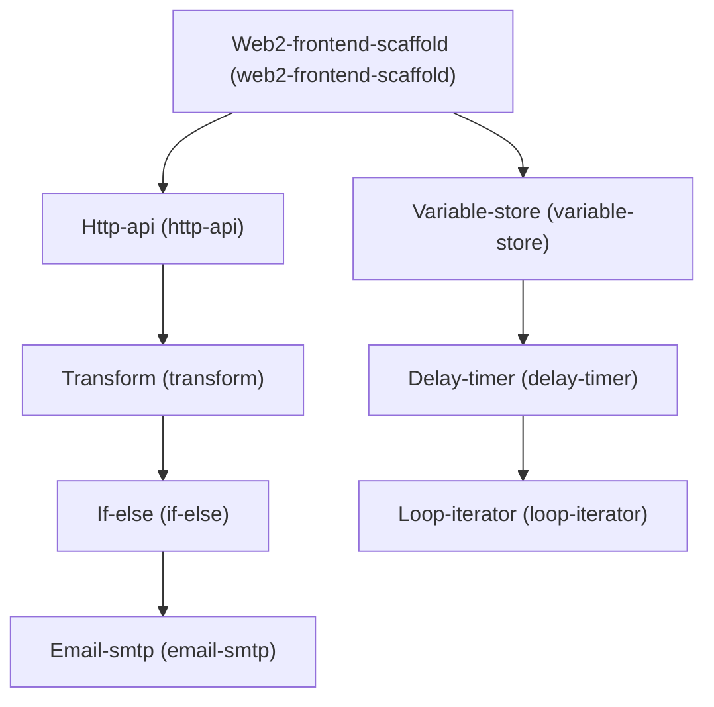

# Architecture

## Dependency Graph

## Execution / Implementation Order

1. **Web2-frontend-scaffold** (`5de60226`)
2. **Http-api** (`320c81d6`)
3. **Variable-store** (`d2396441`)
4. **Transform** (`29cbd0fb`)
5. **Delay-timer** (`0493472a`)
6. **If-else** (`f297985a`)
7. **Loop-iterator** (`310f14b1`)
8. **Email-smtp** (`e944cbf5`)
